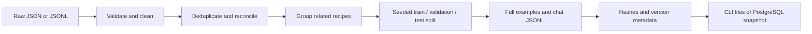

# Prompt 2 — Dataset engineering

RecipeTriage Dataset v1 turns seven individually assembled, source-linked recipe summaries into validated, reproducible teaching data. No recipe generator, model-generated labels, training loop, or weight update runs in this pipeline. The assistant assembled the initial summaries and proposed annotations from published recipes; every record starts **unreviewed**. Read and correct the proposals before treating them as ground truth.

## Learn the concepts

A **supervised dataset** pairs an input with the answer we want a model to learn. Here the input is a recipe; the target is a set of triage labels and a short evidence-based explanation. The 70-minute ravioli input can have several target labels. Saving those targets does not train a model; a later training process would use them to compute a loss and update weights.

A **schema** defines the fields, types, and constraints of a record. `time_minutes` must be an integer or `null`, not the string `"quick"`. Pydantic checks those contracts and reports which fields fail. Shape validation cannot establish that an annotation is factually correct; a valid `dessert` label can still be wrong for a savory pizza. [Pydantic models](https://pydantic.dev/docs/validation/latest/concepts/models/)

**JSON** stores one complete JSON value, such as an array of seven records. **JSONL** stores an independent JSON value on each physical line. Our exports use one object per line, UTF-8, and a final newline. JSONL has no outer array or commas between lines. Newlines inside strings are escaped. It is convenient for processing records incrementally, although this small pipeline intentionally loads its bounded input into memory. The importer tolerates blank lines; the exporter emits none. [JSON Lines format](https://jsonlines.org/)

These abbreviated structures illustrate the difference; they are not complete training records:

```json
[{"id":"seed-001"},{"id":"seed-002"}]
```

```jsonl
{"id":"seed-001"}
{"id":"seed-002"}
```

**Chat-format data** stores messages with `role` and `content`: the system gives the task, the user provides recipe JSON, and the assistant contains the desired answer. A model's **chat template** then turns these messages into text with its expected role markers. Our formatter reuses the inference prompt and appends the labeled answer. For a complete supervised conversation it uses `add_generation_prompt=False`; an empty assistant prefix is useful when asking for a new answer, but the target answer is already present here. Rendering a template does not run generation. [Hugging Face chat templates](https://huggingface.co/docs/transformers/chat_templating)

The **training split** supplies examples for future weight updates. The **validation split** helps choose prompts, settings, or checkpoints. The **test split** is held aside for the final evaluation after those choices. Repeatedly tuning against test results makes the test set part of development. Our requested 70/15/15 proportions round to 5/1/1 with seven rows. These tiny splits demonstrate mechanics, not model quality. [Evaluation splits](https://scikit-learn.org/stable/modules/cross_validation.html)

**Stratification** tries to preserve label proportions across splits. With multi-label recipes, preserving every label simultaneously is harder than balancing a single class. We assign related recipes as groups and use a deterministic greedy heuristic that considers rare labels first. This is approximate stratification, with actual counts shown in metadata. A label occurring once cannot appear in three independent splits. Group isolation takes precedence over perfect ratios. [Stratification and grouped splits](https://scikit-learn.org/stable/modules/cross_validation.html)

**Leakage** occurs when evaluation information influences training or development in a way that makes the evaluation misleading. Putting the same ravioli recipe under different titles in train and test leaks recipe content. Putting the correct labels or reviewer explanation in the user message leaks the target. We deduplicate before splitting, keep source families together, and remove annotation metadata from model input. Public recipes may already occur in a pretrained model's data; our local split checks cannot rule out that separate form of contamination.

**Duplication** gives some examples extra weight and can cause leakage. Matching IDs alone misses a renamed copy. V1 fingerprints normalized ingredients and ordered instructions while ignoring the title. It removes matching copies with consistent annotation and records an audit trail. Conflicting copies block the build for reconciliation. This is exact matching after normalization, not semantic similarity detection. Use `group_id` for known paraphrases or recipe variants with different bodies and URLs.

**Class imbalance** means some labels have far more examples than others. In this seed, `needs-special-equipment` occurs three times, while `dessert` and `have-most-of-this` occur zero times. Do not invent extra examples to hide those gaps. Later, collect and review real examples, inspect per-label precision/recall, and consider training adjustments only after measuring the distribution.

**Multi-label data** allows a recipe to have several labels at once. Ravioli can be a weekend project, need specialized equipment, and suit meal preparation. The labels are an unordered set, stored as a sorted list for stable exports. In our policy, `unclear` is exclusive, and the time constraints prevent `weeknight-30min` and `weekend-project` from coexisting. These are application rules, not universal rules for all multi-label problems.

**Label noise** is an incorrect, ambiguous, or inconsistent target. A title containing “Quick” does not justify the weeknight label when total time is 45 minutes. A missing time is `null`, not zero. Review source evidence and record uncertainty. Our roasted vegetables example retains conflicting source timing in `source_notes` and proposes `unclear`; the validator does not silently guess a time. Review status records a person's assertion of review, not proof that the target is correct.

**Versioning** binds data and its processing decisions to a stable identifier. V1 hashes raw inputs, exported bytes, schema/pipeline/prompt versions, label policy, seed, and ratios. A label correction changes the version. Input row reordering does not. The creation timestamp is recorded but excluded from identity. PostgreSQL saves immutable snapshots, and the CLI refuses to overwrite an existing version directory. A random seed alone is insufficient for reproducibility if the data, prompt, or algorithm changes.

## Every field, using the seed

Open `ml/data/seed.json` beside the Label Editor. The records use the following fields:

| Field | Meaning and example | Sent to the model? |
| --- | --- | --- |
| `recipe.id` | Stable dataset identifier, e.g. `seed-001`; changing a title should not require changing it | No |
| `recipe.title` | Original recipe title, e.g. `Overnight Oatmeal`; not a speed label | User input |
| `recipe.ingredients` | Nonempty list of ingredient descriptions; these classification summaries omit quantities | User input |
| `recipe.instructions` | Ordered, abbreviated steps with evidence about waiting and preparation | User input |
| `recipe.equipment` | Explicit tools/appliances; required field, may be empty | User input |
| `recipe.time_minutes` | Total elapsed time including waiting, when supported; `null` means unknown | User input |
| `recipe.pantry_items` | Optional known pantry context; `null` means it was not supplied | User input |
| `recipe.source_type` | `published` or `personal`; the seed uses `published` | No |
| `recipe.source_uri` | Original HTTP(S) URL for published recipes; personal records can use a stable identifier | No |
| `recipe.source_notes` | Provenance, paraphrase notes, timing assumptions, contradictions | No |
| `recipe.group_id` | Optional shared family identifier for related recipes that must stay in one split | No |
| `labels` | One or more values from the label vocabulary; never an inferred default for imports | Assistant target |
| `rationale` | Short recipe-grounded justification, exported as the assistant's `explanation` | Assistant target |
| `annotation_notes` | Private annotation discussion and uncertainty | No |
| `reviewed` | Whether a person has explicitly checked the example; initially `false` | No |
| `reviewed_by` | Reviewer identity required when reviewed; otherwise `null` | No |

The assistant answer is JSON encoded inside a message's `content` string. That is why you see escaped quotation marks in the surrounding JSONL. The exporter includes all metadata in the ordinary split files; only the `.chat.jsonl` files project examples into model messages. Do not concatenate whole ordinary records into a prompt.

## Seed choices and annotation policy

| ID | Published recipe | Total minutes | Proposed labels |
| --- | --- | --- | --- |
| seed-001 | [Overnight Oatmeal](https://www.nutrition.gov/recipes/overnight-oatmeal) | 375 minimum, including chilling | meal-prep |
| seed-002 | [Black Bean Quesadillas](https://www.texaswic.org/recipes/black-bean-quesadillas) | 30 as conservative bound for “under 30” | weeknight-30min |
| seed-003 | [Peanut Butter Banana Smoothie](https://eat-move-save.extension.illinois.edu/eat/recipes/peanut-butter-banana-smoothie) | Unknown; freezing duration unspecified | needs-special-equipment |
| seed-004 | [Oatmeal Pecan Waffles](https://www.nutrition.gov/recipes/oatmeal-pecan-waffles) | Unknown | needs-special-equipment |
| seed-005 | [Quick and Easy Pizza](https://www.nutrition.gov/recipes/quick-and-easy-pizza) | 45 | weekend-project |
| seed-006 | [Roasted Root Vegetables](https://www.nutrition.gov/recipes/roasted-root-vegetables) | Unknown; conflicting timing | unclear |
| seed-007 | [Homemade Cheese Ravioli](https://www.kingarthurbaking.com/recipes/homemade-cheese-ravioli-recipe) | 70 | meal-prep, needs-special-equipment, weekend-project |

These are short teaching summaries, not full cooking directions or a claim of permission to redistribute full source articles. No recipe title variants from the inference experiment are inserted as new training examples. The ravioli summary already used for inference is included once with its original title.

Validation enforces known labels, no repeats, an exclusive `unclear`, known time <=30 for weeknight, known time >30 for weekend, explicit equipment for the equipment label, and >=80% pantry coverage for the pantry label. Pantry matching uses normalized exact ingredient strings, not ingredient synonym resolution. A weekend project also needs substantial work, and specialized equipment must actually be specialized; these semantic judgments require review. Dessert and meal-prep suitability also require source evidence.

## Run and inspect it

From the repository root, start Docker Desktop and run:

```sh
docker compose up --build --wait --wait-timeout 180
```

On a fresh extraction only, first copy `.env.example` to `.env` (`cp .env.example .env` on macOS/Linux or `Copy-Item .env.example .env` in PowerShell). The backend runs its idempotent PostgreSQL migration before starting the API.

Open [RecipeTriage](http://localhost:8080/) and choose **Data Lab**:

1. **Dataset Studio:** load the original seed, inspect raw JSON, click **Validate & load**, then **Build preview**. Inspect row issues, counts, distribution, and warnings. Unlabeled Recipe imports become drafts with empty targets; you must label them before building.
2. **Label Editor:** select a recipe, read its source and policy, edit labels/explanation, and add review notes. Only mark it reviewed after checking it, and supply your reviewer name. Editing labels, rationale, or notes clears prior review status. Invalid combinations produce explicit validation errors when you build.
3. **JSONL Preview:** choose `train.jsonl` or `train.chat.jsonl` to compare full examples with model messages. Validation and test exports are available too.
4. **Chat Template Preview:** click **Preview messages** without a model dependency, or **Render Qwen chat template** to see actual model-specific markers. The latter may download the pinned tokenizer, but never model weights or generated answers.
5. Click **Save version** and **Download version ZIP**. Changes to inputs/settings invalidate the old preview and download. A saved version survives reloads and is selectable from Dataset Studio. Save before leaving Data Lab; unsaved edits are kept only in component memory. **Token Inspector** remains available as the fifth tab; Playground still supports inference.

The bundled initial snapshot is under `ml/datasets/v1-63135eef80fb9be90547673e7f13d4142eb0eb29852cf098e672b44fca20158f/`. It is not automatically inserted into a fresh database; use the UI save action when you want that persisted copy.

To export without installing host Python, use the running backend container:

```sh
docker compose exec backend python -m recipetriage_ml.data /app/ml/data/seed.json --output /tmp/dataset-exports --seed 42
docker compose cp backend:/tmp/dataset-exports ./dataset-exports
```

Those Docker commands also work in PowerShell. Repeating a build into the same parent intentionally fails if that content version already exists. Inspect the existing export or choose a new output parent; do not delete it merely to make a command pass.

For a lightweight host setup, Python 3.12 is sufficient; no PyTorch is needed for the dataset pipeline:

```sh
python3.12 -m venv .venv
.venv/bin/python -m pip install -r backend/requirements-test.lock
.venv/bin/python -m pip install -e ./ml -e ./backend
.venv/bin/python -m recipetriage_ml.data ml/data/seed.json --output dataset-exports --seed 42
.venv/bin/python -m pytest tests/ml/test_dataset.py tests/backend/test_datasets.py -q
```

On Windows use `py -3.12 -m venv .venv`, then replace `.venv/bin/python` with `.venv\Scripts\python.exe`. If using an existing venv, skip creation and install the updated local packages into that interpreter. For a host-run API, start PostgreSQL and run `.venv/bin/python -m app.migrate` before Uvicorn. README.md contains the full host workflow and PostgreSQL test environment setting.

Run all backend tests against real PostgreSQL and all frontend tests:

```sh
docker compose --profile test run --build --rm backend-tests
npm --prefix frontend ci
npm --prefix frontend test
npm --prefix frontend run build
```

## Processing and reproducibility



The loader bounds input to 2 MB and 1,000 rows, rejects duplicate JSON keys/non-finite numbers, and reports malformed JSONL line numbers. Pydantic rejects missing/unknown fields and invalid types. Cleaning normalizes Unicode and whitespace, without inventing recipe content or labels. Invalid rows are displayed and block a build; they are never silently discarded to produce a passing version.

Deduplication ignores title/ID changes and ingredient ordering; instruction order remains meaningful. Conflicting labels, targets, time, equipment, pantry, or review/group metadata block duplicate removal. Removed copies retain provenance in the audit and `raw.json`. Source aliases from removed copies still participate in grouping. Source URL query/fragment variants are grouped conservatively; this can over-group catalogs whose query string identifies separate recipes. Supply meaningful source identifiers and inspect the reported groups.

The splitter requires at least three independent groups and always creates nonempty splits. Large groups can prevent requested row ratios. Seed 42 currently assigns seed-001/002/005/006/007 to train, seed-004 to validation, and seed-003 to test. One-row validation/test files are for learning the pipeline only. Future model evaluations need a larger, independently reviewed holdout; this inspected seed should not be treated as an untouched test benchmark.

Each export contains `raw.json`, cleaned `examples.json`, six split files (`train`, `validation`, `test`, each ordinary and chat JSONL), and `metadata.json`. Metadata records IDs, grouping, fingerprints, class distributions, source links, duplicate audit, policy/prompt/schema/pipeline versions, requested/actual ratios, warnings, input hash, and file hashes. The complete content hash is the version ID. Metadata timestamps differ between independent builds but file bytes and version IDs match for equivalent input/settings. Increment the pipeline/schema version when changing behavior; the full source package and dependency locks accompany this checkpoint.

## Major files and responsibilities

| File | Responsibility |
| --- | --- |
| `ml/data/schemas.py` | Extends the inference Recipe and defines TrainingExample, cleaning, label policy, and semantic checks |
| `ml/data/seed.json` | All seven readable source-linked examples and proposed annotations |
| `ml/data/pipeline.py` | Raw/unlabeled loaders, cleaning, duplicate audit, grouping, deterministic splitting, chat projection, JSONL and version metadata |
| `ml/data/__main__.py` | CLI entry point; writes a new immutable export directory or exits with an explicit error |
| `ml/data/__init__.py` | Makes the data code an importable package |
| `ml/pyproject.toml` | Installs `ml/` as `recipetriage_ml`, including the seed resource |
| `ml/datasets/` | Actual exported Dataset v1 checkpoint; inspect every row |
| `backend/app/schemas.py` | Exposes shared dataset schemas for backend code |
| `backend/app/datasets.py` | Data Lab HTTP routes, preview, PostgreSQL save/load, ZIP downloads, and chat preview |
| `backend/app/migrate.py` | Idempotently creates the immutable version table with a transaction lock |
| `backend/app/main.py` | Registers the dataset router alongside health and inference routes |
| `backend/Dockerfile` | Packages the ML code/seed and runs the migration before API/test startup |
| `frontend/src/DataLab.jsx` | All four new pages, imports, label/review editing, exact exports, metadata, saved versions, and Token Inspector tab |
| `frontend/src/App.jsx` | Connects left navigation to Data Lab and the retained inference Playground |
| `tests/ml/test_dataset.py` | Invalid labels/fields, duplicates/conflicts, leakage, deterministic splits, hashes, parser errors, and chat contracts |
| `tests/backend/test_datasets.py` | API validation plus real PostgreSQL snapshot persistence/idempotence/download tests |
| `frontend/src/DataLab.test.jsx` | UI workflow, retained invalid drafts, export invalidation, and chat navigation |
| `.github/workflows/ci.yml` | Runs frontend/build/container/backend checks including the dataset tests on push/PR |

Product code in `frontend/` handles interaction; serving code in `backend/` owns HTTP requests and persistence; reusable ML/data code in `ml/` transforms recipes independently of either. The same pure pipeline powers CLI tests and the web app. This keeps data rules consistent and allows future training to run separately from web requests. `ml/` contains learning code and data artifacts, not just training data.

The API prefix is `/api/v1/datasets`. GET `/seed` provides examples/policies/schemas; POST `/validate` reports issues and retains drafts; POST `/preview` builds without saving; GET/POST `/versions` lists or saves snapshots; GET `/versions/{version}` loads one; GET `/versions/{version}/download` returns a ZIP; POST `/chat-preview` returns messages and optional rendered text. API docs are at [localhost:8000/docs](http://localhost:8000/docs). The UI on port 8080 proxies these requests to the backend. PostgreSQL's container hostname is `postgres`; a host-run API connects to `localhost`.

## Check your understanding

1. What is the input and what is the target in the ravioli TrainingExample? Which metadata must stay out of the user message?
2. Why can changing a recipe's title and ID still cause leakage if copies land in different splits?
3. Why can't seven recipes guarantee representative train/validation/test coverage for all seven labels?
4. What should happen when you change a label after saving a version, and why is a seed alone insufficient to reproduce a dataset?
5. Explain inference versus training in your own words. Does exporting chat JSONL perform either one?
